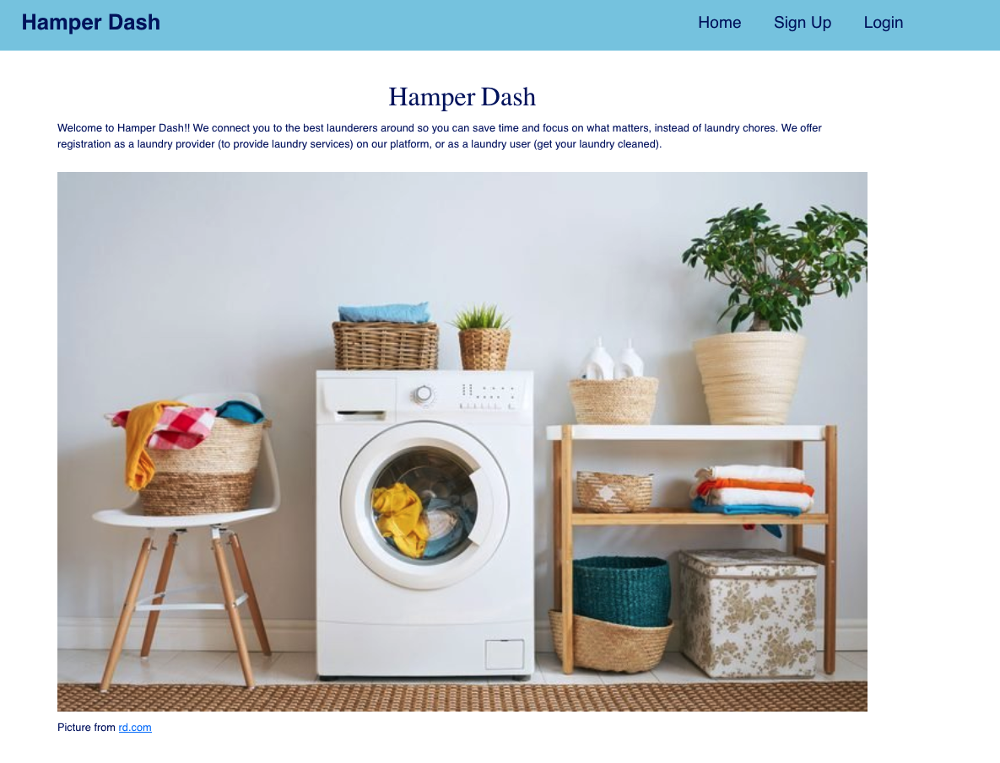
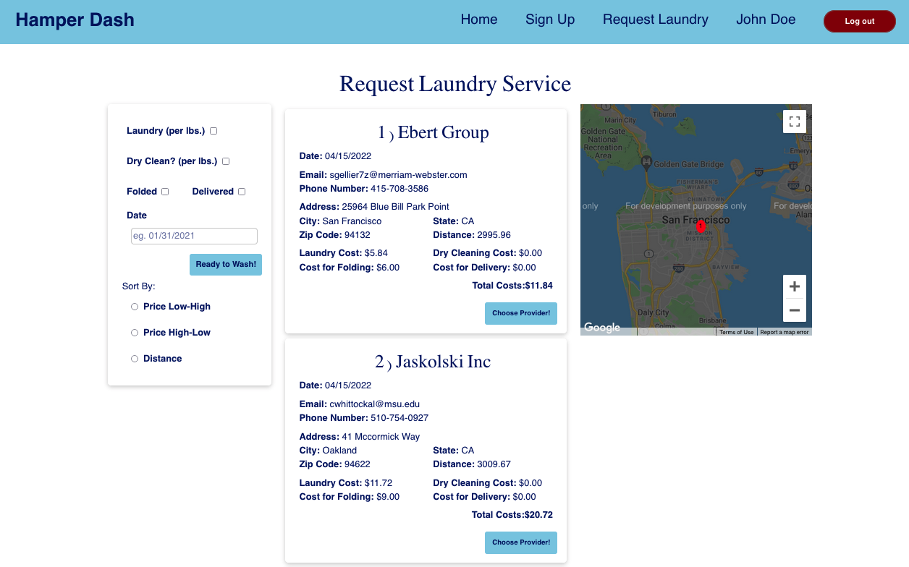
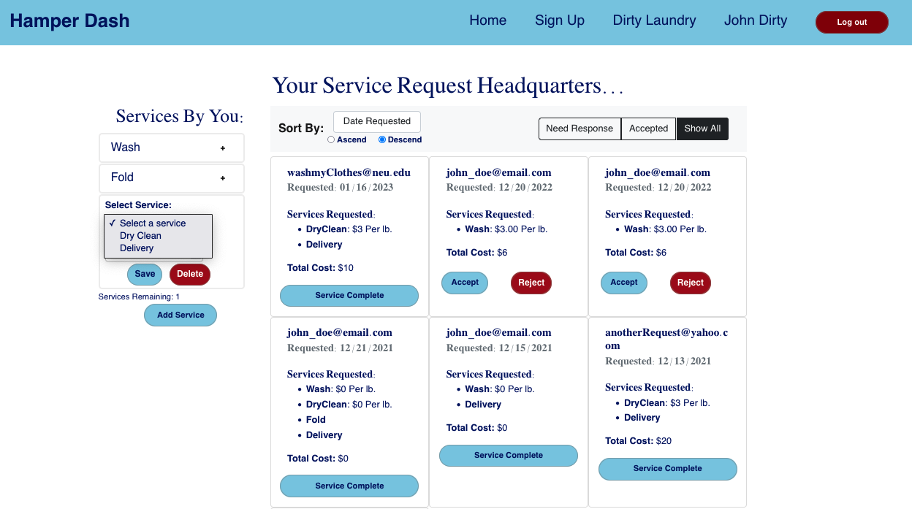

# [Hamper Dash - Laundry App](https://hamperdashp4.herokuapp.com/)

## Objective:

Create a working platform app that provides users and providers to request/provide laundry services.

As a registered user you can request laundry/dry cleaning as well as additional options like folded or delivered. You can narrow the provider results by the selective criteria of your laundry needs and sort the providers by price/distance. You can then select which provider you wish to engage in the transaction with. You can edit your profile details in the profile page.

As a registered provider you can individually add which laundry services you wish to provide, such as delivery, dry clean, folding, or wash. You can then individually edit the prices for each of the services as well as remove the services completely. When a customer makes a request, their request will populate the screen. The registered provider can sort by date or by total fee for the service. The provider can also chose to accept or reject a service request. If user accepts a request they will then have a button they can use to inform the user that there laundry is ready.

## Project URL:

[Hamper Dash Heroku Depolyment - Project 4](https://hamperdashp4.herokuapp.com/).

## CS 5610 Web Development - Northeastern University Bay Area

- [Student Submissions](https://johnguerra.co/classes/webDevelopment_fall_2021/students/index.html)

## Video Demonstration:

### Public Video

- [Hamper Dash Youtube Demo Video](https://youtu.be/v5N9a09EgNk).

### Usability & Accessibility

- [Hamper Dash Usability & Accessibility Upgrades](https://youtu.be/fj8K9i5uzZ0)

- [Usability Study Report - Google Doc](https://docs.google.com/document/d/1iN96IRm_o-DwhS6HJ-GfkI4dUBxc-58EMXDhM8Ucw9k/edit?usp=sharing)

## Local Execution

- Download/clone this project from [Hamper Dash - Laundry App GithHub Repo](https://github.com/michaelchang106/laundryApp).

- Make sure to install node.js, which will come with node project manager (npm).
- Change to the folder where you download the applicaiton using the OS terminal.
- switch to project4 after cloning the repository and run `git checkout project4`
- Next, type in the terminal `yarn install` to install all the dependencies.
- Type in the terminal `yarn start` to start the server.
- In a new terminal tab browse to laundryApp/front and type `yarn start` to start the front end React development server.
- In your favorite browser go to http://localhost:3000/.

## Google Slides

[Hamper Dash - Laundry App Google slides](https://docs.google.com/presentation/d/1ENfxY8uqDCAj_f8ncWrERZQN6R7fYMTccHmIKPDP6W4/edit#slide=id.g104b88d51b4_0_125)

## Hamper Dash Screen Shots

## Folder Content (Backend):

### database

- Contains all the JavaScript code for managing and querying interactions with the MongoATLAS server.

### routes

- Contains all the JavaScript code for handling the route requests coming from the front end.

## Folder Content (Frontend):

### public

- Contains the base index.html used for rendering the React root.

### src

- Contains the different directories organized by:
  - components - the different React components built and organized by
    - customer
    - layout
    - login
    - provider
    - signups
    - ui
  - images - images used in the different components and pages
  - pages - the page components that are the face of what the user sees and houses other sub-components
  - store - the data store that is used for delivering context throughout components

## Division of works and tasks

### Both team members collaborated and contributed evenly on:

- Database (dbManager)
- index Routes
- MongoDB implementation
- CSS styling

### [Michael Chang](https://github.com/michaelchang106)

- Users (customers)
- Login
- User Sign Up

### [Daniel Lisko](https://github.com/djlisko01)

- Providers
- Provider Sign Up

## Test Accounts

### Customer Test Account

- Email: john_doe@email.com
- Password: 123

### Provider Test Account

- Email: dirtybiz@gmail.com
- Password: 123
